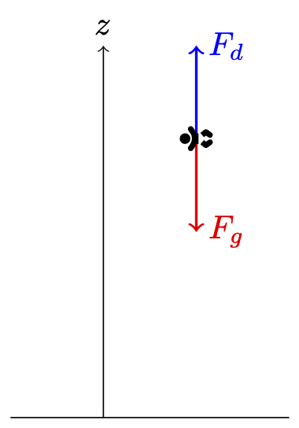

# Øving 04 Numerikk


## Spørsmål 01


Vi ser på en fallskjermhopper med masse $m=70 kg$ i fritt fall. La $z$ være høyden til fallskjermhopperen i meter over over bakken, denne vil være en funksjon av tid, $z(t)$. Den tidsderiverte av høyden er hastigheten *v*, denne vil være negativ siden høyden $z$ avtar. Ved starttidspunktet $t=0$ er fallskjermhopperen i ro, tre tusen meter over bakken. Kreftene som  virker på fallskjermhopperen i vertikal retning er tyngdekraften $F_g$ og friksjonskraften $F_g$ grunnet luftmotstand (*draget*). Nettokraften bestemmer akselerasjonen, det vil si den tidsderiverte $v'$

 av hastigheten gjennom Newtons andre lov: 
$$
mv' = F_d - F_g
$$
Vi kan anta at friksjonskraften $F_d$ grunnet luftmotstand (drag) er proporsjonal med kvadratet av hastigheten $v$, og den tilhørende proporsjonalitetskonstanten $b$ vil avhenge av blant annet lufttetthet og overflaten til hopperen. I dette tilfellet får vi opplyst at verdien av denne er $b=0.42$. Tyngdekraften er som vanlig  $F_g = mg$, hvor vi antar at tyngdeakselerasjonen har verdien $g=9.81 m/s^2$.

Informasjonen ovenfor bestemmer et startverdiproblem for posisjonen $z$ (målt i meter) og hastigheten $v$ (målt i meter per sekund) til fallskjermhopperen.

Skriv ned riktige uttrykk for differensialligningene uttrykt med $z$, $v$, $m$, $g$ og $b$. Altså, ikke sett inn tallverdier her, og skriv heller ikke f.eks. $z$ som $z(t).

$z' = [svar]$

$v' = [svar]$

Hva er de tilhørende startverdiene?

$z(0) = [svar]$

$v(0) = [svar]$

Terminalhastigheten er  hastigheten hopperen har når draget balanserer tyngdekraften eksakt,  slik at nettokraften er null. Hva er terminalhastigheten $v_T$ her, oppgitt med to desimaler? Husk at denne skal være negativ.

$v_T = [svar]$




## Spørsmål 02

I forrige oppgave fant du forhåpentligvis ut at høyresiden i uttrykket for *v*′ kun involverte hastigheten *v* og ikke posisjonen *z*

. Dermed kan man løse startverdiproblemet for fallskjermhopperens hastighet uavhengig av posisjonen.

Dersom du er dreven i integrasjon kan du løse denne ligningen og finne at svaret blir 

$v(t) = −v_T tanh(\frac{gt}{v_T})$ , hvor $tanh(x) = \frac{e^x - e^{-x}}{e^x + e^{-x}}$


 og $v_T$ er terminalhastigheten fra tidligere.

**(a)** Her vil vi i stedet se hvor godt vi kan tilnærme denne løsningen med Eulers metode. La steglengden $h=1$, slik at $t_k = kh = k$, og bruk Eulers metode til å finne tilnærmingen $k = 0, …, 30$. Lagre svaret i et array kalt `vk`.

Om du vil kan du prøve å plotte  hastighetene du finner, og sammenligne hastigheten etter tretti sekunder med terminalhastigheten du fant i forrige oppgave.

**(b)** Fra forrige deloppgave har vi en tilnærming av hastigheten $v$ for hvert tidspunkt $t = t_k$. Da kan vi bruke numerisk integrasjon til å finne en tilnærming av  høyden til fallskjermhopperen etter tretti sekunder med fritt fall. Bruk trapesmetoden til å finne en tilnærming av 
$$
z(t) = z(0) + \int_{0}^{t} v(s)ds
$$
for $t_k$, $k = 0, …,30$. Lagre svaret i et array kalt `zk`.


~~~python
```
import numpy as np

# estimer hastigheten
b = 0.42 # factor
m = 70
g = 9.81 # tyngdeaakselerasjon

# estimer hastigheten
vk = ?

# Eulers metode
# ...

# estimer posisjonen
zk = ?

# trapesmetoden
# ...
```
~~~


Svar, feil

```python
import numpy as np
import matplotlib.pyplot as plt

# Parametere
b = 0.42 
m = 70 
g = 9.81  
h = 1  
n_steps = 30 
v_T = -np.sqrt((m * g) / b)  # Terminalhastighet

# Startverdier
v0 = 0  
z0 = 3000  

# Array for hastighet (v_k) og posisjon (z_k)
vk = np.zeros(n_steps + 1)
zk = np.zeros(n_steps + 1)

# Initialbetingelser
vk[0] = v0
zk[0] = z0

# Eulers metode for hastighet
for k in range(n_steps):
    vk[k + 1] = vk[k] + h * (- (b / m) * vk[k]**2 + g)

# Trapesmetoden for høyde
for k in range(n_steps):
    zk[k + 1] = zk[k] + (h / 2) * (vk[k] + vk[k + 1])

```


## Spørsmål 03

Her skal du skrive inn svarene dine fra Jupyter-notatet *Dynamikk i konstruksjoner*.

**a)** Initialbetingelser for initialverdiproblemet.

$y(0)= [10]$

$y'(0) = [0]$


**b)** Sett opp matrisen $A$, uttrykt med størrelsene $m$, $c$ og $k$.

 (ikke bruk tallverdier her).
$$
A = 
\begin{bmatrix}
[svar] [svar] \\
[svar] [svar] 
\end{bmatrix}
$$


**c)** For skrittlengde $h=1$, oppgi tilnærmingen av 


$$
\overrightarrow{y}(1) = 
\begin{bmatrix}
y(1) \\
y'(1)
\end{bmatrix}
$$
 som du får med Eulers metode.

Svar:
$$
\overrightarrow{y}(1) \approx 
\begin{bmatrix}
10 \\
-15
\end{bmatrix}
$$


**e)** Oppgi rotasjonshastigheten $\rho$ som vindturbinen bør unngå, bruk to gjeldende siffer i svaret ditt.

$\rho = [svar]$

 


## Spørsmål 04

Her skriver du inn koden din for deloppgave **d)** i Jupyter-notatet *Dynamikk i konstruksjoner*. 

```python
import numpy as np
# Parametre
m = 200000 # Enhet: kg
c = 40000  # Enhet: N*s/m
k = 300000 # Enhet: N/m
h = 0.05 # Sekund
duration = 60 # Sekund

#-------------------------------------------------
# SKRIV DIN KODE HER: lagre egensvingningene som y
#-------------------------------------------------


```


Riktig svar:
```python
import numpy as np
# Parametre
m = 200000 # Enhet: kg
c = 40000  # Enhet: N*s/m
k = 300000 # Enhet: N/m
h = 0.05 # Sekund
duration = 60 # Sekund

#-------------------------------------------------
# SKRIV DIN KODE HER: lagre egensvingningene som y
#-------------------------------------------------

num_steps = int(duration / h)  # Antall skritt for simuleringen

# Initialbetingelser (fra deloppgave b)
y0 = 10.0    # Initial posisjon (meter)
v0 = 0.0     # Initial hastighet (meter per sekund)

# Matrise A fra tidligere
A = np.array([[0, 1], [-k/m, -c/m]])

# Tidsarray
t = np.arange(0, duration + h, h)

# Initier arrayer for posisjon og hastighet
y = np.zeros(len(t))
v = np.zeros(len(t))

# Sett initialbetingelser
y[0] = y0
v[0] = v0

# Euler-metoden for å løse systemet
for n in range(len(t) - 1):
  # Tilstand på tidspunkt t_n
  state = np.array([y[n], v[n]])
  
  # Beregn neste tilstand
  next_state = state + h * A.dot(state)
  
  # Oppdater posisjon og hastighet
  y[n + 1] = next_state[0]
  v[n + 1] = next_state[1]
```


## Spørsmål 05

I denne oppgaven skal du bruke Jupyter notebook-notatet *Skrått kast*.

**a)** Nedenfor skal du skrive inn de omtrentlige svarene som du leser av fra grafen (oppgitt i grader!). Her tillater vi avvik på $±5$ grader.

Den minste vinkelen: $25$ grader

Den største vinkelen: $50$ grader


## Spørsmål 06

I denne oppgaven skal du bruke Jupyter notebook-notatet *Skrått kast*.

**b)** Nedenfor skriver du inn svarene som du fikk med Newtons metode. Vi vil ha svarene i grader, med to desimalers nøyaktighet.

Den minste vinkelen: 28.16


Den største vinkelen: 47.80

Kode:
```python
import numpy as np
import matplotlib.pyplot as plt

# Parametre
y_bakke = -7  # Høydeforskjell mellom kanonstilling og blink
g = 9.81      # Tyngdekraftskonstant
x_lengde = 28 # Horisontal distanse til blink
v0 = 15       # Starthastighet

# Funksjonen F(theta)
def f(theta):
    return x_lengde * np.tan(theta) - (0.5 * g * (x_lengde / (v0 * np.cos(theta)))**2) - y_bakke

# Deriverte av F(theta)
def df(theta):
    return x_lengde / np.cos(theta)**2 - (g * np.sin(theta) / np.cos(theta)**3) * (x_lengde / v0)**2

# Newtons metode
def newtons_method(theta0, tol=1e-6, max_iter=100):
    theta = theta0
    for i in range(max_iter):
        f_val = f(theta)
        df_val = df(theta)
        new_theta = theta - f_val / df_val

        if abs(new_theta - theta) < tol:  # Sjekk for konvergens
            break

        theta = new_theta

    return theta

# Bruk Newtons metode med to forskjellige startpunkter
theta_start1 = np.radians(25)  # Startverdi i radianer for første løsning
theta_start2 = np.radians(50)  # Startverdi i radianer for andre løsning

theta1 = newtons_method(theta_start1)
theta2 = newtons_method(theta_start2)

# Konverter resultatene tilbake til grader
theta1_deg = np.degrees(theta1)
theta2_deg = np.degrees(theta2)

print(f"Nullpunkt ved første startverdi: {theta1_deg:.6f} grader")
print(f"Nullpunkt ved andre startverdi: {theta2_deg:.6f} grader")
```


## Spørsmål 07

Her skal du skrive inn svarene dine fra Jupyter-notatet *Ideell pendel*.

**a)** Skriv opp ligningen som $\theta_{n+1}$ oppfyller. Foruten $\theta_{n+1}$ skal ligningen også innholde størrelsene $\theta_{n}$, $\varphi_{n}$ og $h$. Bruk multiplikasjonstegnet `*` for produkter.

Svar:

`theta[n+1] = theta[n] + h * (phi[n] - h * sin(theta[n+1]))`

**Merk:** I boksen ovenfor må du skrive `theta[n+1]` for $\theta_{n+1}$, `phi[n]` for *$\varphi_{n}$*, osv.


**b)** Du er gitt startverdiene $\theta_0 = \frac{pi}{2}$, $\phi_0 = 0$ og skrittlengden $h = 1$ for implisitt Eulers metode.

Skriv inn verdien du får for $\theta_1$ med Newtons metode med startgjetning $\theta_0$ og som oppfyller avviket $|f(\theta_1)| \leq 10^{-3}$ Skriv også inn den tilhørende verdien for $\phi_1$. Oppgi svarene med tre gjeldende siffer.

$\theta_1 = 0.832$

$\phi_1 = -0.739$


## Spørsmål 08

Her skal du skrive inn koden din fra Jupyter-notatet *Ideell pendel,* inkludert funksjonen `theta_steg()`.

Du må lagre verdiene dine for $\theta_n$ og $\phi_n$ gitt av implisitt Eulers metode som arrays med navnene `theta_i` og `phi_i`.

**Merk:** Det er viktig at du ikke skriver ut noe ekstra output for at testen skal godkjenne svaret ditt.

Answer:

Startkode:
```python
import numpy as np

# variabler og funksjoner du trenger:
# antall steg, steglengde, startverdier, ...

def theta_steg(theta_n,phi_n,h,tol=1e-3):
    #-------------
    # din kode her
    #-------------

theta_i = np.zeros(?) # array for å lagre verdier av theta for implisitt Euler

phi_i = np.zeros(?) # array for phi

# 100 steg med implisitt Euler
#-------------
# din kode her
#-------------
```

